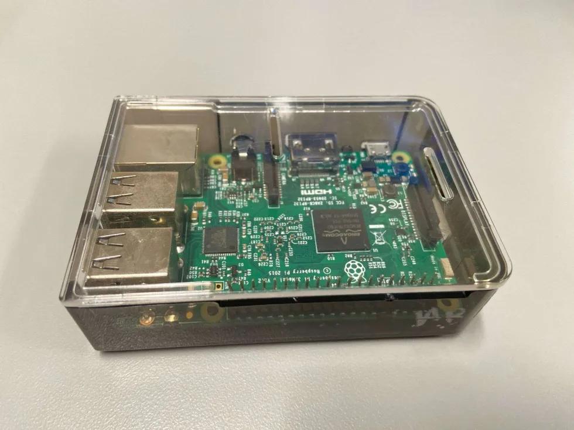

<!-- height or width of logo may be adjusted -->
<!-- This section is where you will replace the link to your transparent logo, the title of your project, and the very short desciptor of your project -->
<!-- If you used Canva to make your icon and don't want to pay for a background remover, you can use the website https://www.remove.bg/ to do so -->

  
  <h1 align="center">Raspberry Lites (A demonstration of hardware and software integration)</h1>
  
A project for developing students by Jeron Clarke, Genesis Knight and Ricardo Calderon 

<!-- the emojis are not set in stone! If you'd like you can remove them entirely or select your own from https://gist.github.com/rxaviers/7360908 you are welcome to -->

## :loudspeaker: About - 
The objective of the workshop is to remind and demonstrate to students the innerworkings of making physical applications with code. In a world that is heavy focused on software and digital products, we want to present an application that reminds those curious about tech that it can also be applied in real life situations with a little creativity.

<!-- You can look at other TAP projects if you need a better idea of how to describe your workshops objectives -->

This workshop has participants 
understand the process themselves by going hands on into making their own project. They will be able to learn how the different devices are connected together, what software is needed to initialize the project and how they can create their own program to run their own application seamlessly. They will be able to troubleshoot with our team members if they run into problems and demonstrate their light show to others when they are done!

## :bulb: Project Information
<!-- 
Your Options for target audience: 
  - High School
  - College
  - Middle School
  - K-12
  - Non-Stem
  - Undergraduate
You can select from a range of audiences or a single auidience. Examples: 
    Middle School - College 
    High School - College
    K-12
  You will be presenting most often to your peers who are taking introductory technology classes, so more often than not you should be including college in your target audience range. 
-->
* <b>Difficulty Level:</b> Beginner - Intermediate
* <b>Target Audience:</b> K12 - College Students
* <b>Duration of Workshop:</b> 45 minute workshop
* <b>Needed Materials:</b> Rasperry Pi 3 boards, 60 Pixel LED Strips, IR non-contact temp sensors, microphone sensors, Breadboards, wire connectors,  Monitors.
* <b>Learning Outcomes:</b> The primary goal of this project is to teach participants how code can be applied to physical applications and to boost creativity in thinking outside the computer screen.
* <b>Main Technology:</b> Raspberry Pi is a small, low-cost computer that's used for a variety of projects, including digital art, education, and home automation. 
* [Technology Ambassador Program](https://tapggc.org/) <b>(TAP)</b> is a project-based class that provides a collaborative environment for students to work with their fellow classmates on a semester-long project using technologies of their choice. TAP strives to increase participation in IT through numerous outreach activities and workshops that are designed to showcase the creative and fun side of technology.
<!-- Commercial Video stored in the Media folder will be linked here -->

Commercial Under Construction

<!-- videos can also be dragged and dropped into markdown files if you want them embedded -->

## :pencil2: Team: Keep it Lit

<!-- Use the team photo of your choice once youve uploaded it to the team photo folder within the media folder -->

> (From left to right: Batman,  Superman, Wonderwoman.)
<!-- replace with full names of your team members -->

* Jeron Clarke 
* Genesis Knight
* Ricardo Calderon

## :mortar_board: Advisors
<!-- name of the two professors overseeing your TAP class -->
* Dr. Gunay
* Dr. Robertson

## :pencil2: Team Photos: Workshops 

<!-- Use the team photo of your choice once youve uploaded it to the team photo folder within the media folder -->

## :page_with_curl: Project Description
This workshop is designed to provide students with hands-on experience in programming and hardware interaction using Python 3, Thonny IDE, a Raspberry Pi 3B+ and with WS281B LED light strips. The primary objective of this project is to introduce students to programming using Python 3 on a Raspberry Pi 3B+ with the Thonny IDE. The workshop aims to build a foundational understanding of algorithms while enabling students to create their own interactive programs. To reinforce their learning, students will complete a coding challenge by writing a small algorithm of our choosing. This task, tailored to their average skill level, will demonstrate their understanding of key programming principles. By the end of the workshop, participants will have hands-on experience with Python, algorithmic thinking, and hardware interaction using the Raspberry Pi.  Students will then engage in a hands-on activity where they control LED light strips using Python to visualize algorithms in action. The goal is to recreate a light show using the given tools and explain how it was recreated. The survey will cover key topics such as LED strip wiring, power management, the role of pins, and algorithmic concepts. By comparing pre- and post-survey results, we will track progress, identify areas for improvement, and gather participant feedback. The survey will indicate the progress of the students and how their core programming skills improve after participating in the Raspberry Pi light show. The goal is to introduce fundamental programming concepts through an engaging, hands-on platform: a Raspberry Pi-powered LED light strip system. By using light patterns to visualize algorithms, K-12 students and non-IT college students will develop an intuitive understanding of algorithmic thinking. With our surveys we can better understand how well integrated our teaching strategy is and how impactful it is on students that have not been familiarized with IT concepts.

## :memo: Publications
<!-- team members, then professors/advisors. "Name of Publication", event, month and day, year, Georgia Gwinnett College. -->
1. Jeron Clarke, Genesis Knight, Ricardo Calderon, Dr. Gunay, Dr. Robertson. "A "Lite" Workshop!", Event Coming soon, TBD, Georgia Gwinnett College.  

## :open_hands: Outreach
<i>To be Announced </i>

## :mag_right: Similar Projects
<i>Use this section to link to a project done in the TAP program that is related in some way to your own. This can be a sister project done during your TAP semester or a TAP project done in the past. Example: </i> 

## :computer: Technology
<i> Raspberry Pi </i>
<!-- be sure to use the alt text feature in case anybody viewing your repo is using  screen reader! you want your workshop to be as accessible as possible -->

  

* The Raspberry Pi is an affordable, compact computer that’s great for learning, DIY projects, and experimentation. Its small size, low cost, and extensive community support make it ideal for coding, IoT, and hardware projects. We want to showcase just a few ways that it can be implemented to go beyond digital limitations and bring out applications that we can see and feel in the physical world.

## Project Setup/Installation 
<h3><b>What you will need :</b></h3> 
Raspberry Pi running with Raspbian Legacy Bullseye OS
 
 
External Power supply for LED strip 
 
LED Strip 
 
Jumper Wires 
 
 
<iframe width="560" height="315" src="https://www.youtube.com/embed/zgtglnj2uuI?si=Ljt1SPkOE0Ld56cY" title="YouTube video player" frameborder="0" allow="accelerometer; autoplay; clipboard-write; encrypted-media; gyroscope; picture-in-picture; web-share" referrerpolicy="strict-origin-when-cross-origin" allowfullscreen></iframe>
 

<h3><b> Setup: </b></h3>
<ul>
<li>Open Terminal in Raspberry Pi</li>
<li>3 libraries must be installed using the following commands:</li>
<li>sudo pip3 install rpi_ws281x</li>
<li>sudo pip3 install adafruit-circuitpython-neopixel</li>
<li> sudo access to Thonny IDE (Run in terminal sudo Thonny)</li>
<li>sudo python3 -m pip install --force-reinstall adafruit-blinka</li>
<li>Connect 5v LED Strip to 5v Power Supply with positive (red) wire and ground/negative (black) wire.</li>
<li>Connect 5v LED Strip to Ground Pin with ground wire (black) and Pin 18 on GPIO with data wire (green).</li>
<li>Make Sure dtparam=audio=on is set to off in config file</li>
<li>In terminal, type sudo nano /boot/config.txt</li>
<li>Change dtparam=audio=on to dtparam=audio=off</li>
<li>press | Ctrl + X | and then | Y | to save and exit</li>
<li>Open Thonny from terminal using the command sudo thonny for root privileges</li>
<li>Make sure Thonny is running in normal mode (restart to put changes in effect)</li>
<li>Use provided template or strandtest.py</li>
</ul>

## Usage
Coming Soon

## Short Demo Instructions 
1)	Edit LED_COUNT for the number of Pixels you want to turn on (0-60)
2)	Edit  LED_BRIGHTNESS  for the level of brightness (0– 255)
3)	Edit color() parameters for colorWipe() and theaterChase() (0-255)
a.	color(x , y , z)
4)	Run code and enjoy the light show!

## Workshop Instructions 
Coming Soon

